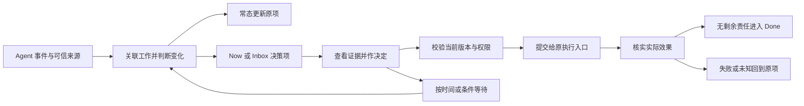

# Overload 产品方案：Agent 工作的决策收件箱

日期：2026-09-26  
状态：Phase A 实施进行中，当前测试通过，但 §14 生产发布门槛尚未满足；Phase B 已在工作树中实现，由 `OVERLOAD_CONDITION_WAITS` 开关控制，默认关闭、未部署；Phase C 尚未开始；本文不代表功能已生产启用或真实渠道验收通过。
依据：本地 Overload、LoopX 源码及既有设计。以当前源码描述“现有基础”；以“本方案”描述目标行为。本文补充产品取舍与验收要求，不替代已有工程契约，不授权部署、对外写入或默认启用自动执行。

## 1. 产品定义与选择

**当多个 Agent 同时工作时，Overload 只把需要你判断的事情送到面前，提供足够证据，并跟踪决定是否真正落实。**

用户购买的价值是减少巡视、理解和追问；产品的核心单位是一次需要人承担责任的决定。Session、事件、运行器与监控都是支撑它的能力。

本方案选择完善现有注意力闭环。扩大监控面有助于覆盖更多来源，但单独增加状态展示不能证明减少巡视；引入完整长期任务调度内核会扩大执行所有权与维护范围。两者都不作为本轮主线。

### 1.1 目标用户和使用边界

| 项目 | 产品定义 |
| --- | --- |
| 首要用户 | 同时使用多个本地或 SSH 可达 Agent 会话的单操作员，需要跨任务安排自己的注意力 |
| 典型工作 | 多仓库开发、审阅交付、处理异常、等待依赖、在中断后恢复工作 |
| 首要入口 | 本地 Web 决策工作台；CLI 保留可操作出口；飞书为可选输入输出渠道 |
| 平台范围 | 继续沿用本地优先、macOS、loopback 服务；SSH 观测能力不自动意味着远程控制能力 |
| 人工责任 | 每项决定有唯一责任人；当前为单操作员模型，不扩展成组织派单、轮值或多租户权限平台 |
| 成功结果 | 不巡视也能发现必要介入；打开卡片能理解并作决定；决定后不需要反复询问是否生效 |

普通观察会话不必先填任务契约。需要托管执行、自动续跑或自动授权时，才要求目标、范围、验收、预算和责任人完整。

### 1.2 本轮产品决策

| 编号 | 决策 |
| --- | --- |
| D1 | 首期同时交付证据卡、实质变化提醒、决定落实回流，形成可用闭环 |
| D2 | Now / Inbox / Done 保持主信息架构；工作事实、注意力状态、执行效果分别表达 |
| D3 | 普通等待默认进入 Inbox；紧急程度必须有风险、期限或损失扩大的事实依据 |
| D4 | 条件化等待在第二阶段交付，优先支持确定性条件；成立只说明可以重新评估，不产生新的执行授权 |
| D5 | 执行沿用已有适配器和权限；不新增通用 Agent runtime、Todo 调度平台或全局 leader |
| D6 | 历史上经常批准只能形成规则建议，不能自动扩大永久权限 |

## 2. 现有基础与本次增量

| 能力 | 已核对的现有基础 | 本方案补齐 |
| --- | --- | --- |
| 工作定义 | Work、版本化 Contract，含验收、范围、预算、停止条件、责任人 | 用自然语言渐进补全；在卡片中展示与当前决定相关的约束 |
| 决策证据 | DecisionViewPackage 已有证据、历史决定、产物、现场入口、过期对象 | 接入真实页面，替换主要用户流程里的原始 JSON 阅读；补充选项效果说明 |
| 注意力分区 | 已有 Now / Inbox / Done、ack、defer、resolve | 让落实中、等待中可追踪；不把它们计为新的人类待办 |
| 通知 | 当前 nudge 使用新增 subject，其中 Attention subject 带 revision | 独立判定值得打断的变化，持久化去重与发送结果 |
| 延后处理 | 已有时间型 defer，当前界面提供一小时延后 | 增加按条件等待、截止时间和有界观察 |
| 决策执行 | 已有 mailbox、消费凭据、effect_state 与运行时接口 | 在同一用户流程明确显示已记录、已消费、执行中、已核实、未知或失败 |
| 产物与恢复 | 已有版本化产物、验收、上下文包装配与有限恢复 | 从决定直接到验收/恢复，保留不可恢复时的具体原因与原现场入口 |
| 审计 | 已有 ledger 与 audit 基础 | 把通知、等待、消费、效果及反馈关联到同一决定，显示指标覆盖缺口 |

重要现状：当前证据按钮直接展开 `item.evidence`；当前 `listAttention` 对三个分区的筛选没有纳入 `applying`。因此“完整证据界面”和“落实中持续可见”都需要读模型与页面联动，不能仅修改文案。相关出处见 §17。

## 3. 用户主流程

### 3.1 正常执行

用户已有几个会话在工作。Agent 的读取、修改、检查与普通进度只更新 Work。Overload 不主动播报。用户打开工作台时，先看“现在需要你处理的事项”，无需浏览所有会话才能确认是否有事。

### 3.2 交付验收

Agent 提交交付物和检查结果。存在人工验收条款时，生成 Inbox 卡片，明确验收对象版本、通过的检查、尚未核实的部分与需要判断的条款。用户接受或退回并写必要原因。接受后仍有执行效果需要核实，则显示落实中；所有验收和未决责任关闭后，工作才可完成。

### 3.3 异常止损

系统发现相同检查持续失败且没有有效进展，原项显示失败证据、已用预算与建议动作。普通可恢复失败在既有预算内处理；预算耗尽、权限边界或损失扩大才要求人介入。用户可在当前权限内选择继续、缩小范围或停止；新增预算和承重范围变化必须展示影响并留新版本。

### 3.4 等待外部依赖

用户选择“等这个 PR 合并后再处理”，指定准确来源和截止时间。事项进入安静的跟进列表。观察无变化时不通知、不调用模型反复判断。条件满足后，重新核验工作版本、验收、权限与执行现场：已有合法续跑约定则交给原执行器；其余情况把原项带回待处理区。

### 3.5 决策过程中依据变化

用户打开卡片后，源产物或任务范围发生变化。提交旧决定时，服务端拒绝过时动作，显示“依据已更新”及具体差异。保留用户输入作为草稿，但不自动把旧选择套到新范围。用户仍能查看记录、补充说明或回原现场。

## 4. 信息架构

### 4.1 主导航

| 页面 | 首要问题 | 内容与排序 |
| --- | --- | --- |
| Now | 哪些事拖延会产生明确损失？ | 风险扩大、即将失效、必须立即处理的不可恢复异常；展示为什么现在要处理 |
| Inbox | 哪些事可以集中判断？ | 普通问题、授权、验收、需补充证据的事项；另有默认折叠的“跟进”区 |
| Done | 我之前决定了什么，结果是什么？ | 已解决或被取代的决定、结果证据、责任人、时间、历史关联 |

Now 同级排序稳定：风险扩大优先，其次临近有效期，再看有证据的关键路径阻塞，同级按进入时间。普通阻塞仍留 Inbox，不因 Agent 正在等人就获得紧急级别。排序给出原因，不使用黑盒紧急分。

Inbox 的“跟进”区显示“落实中”和“等待条件”，单独计数，不进入待决策徽标，不产生进度通知。Work 详情也展示相同状态。三主导航不增加新的顶级队列。

Done 表示该决定已无剩余人类责任，不意味着整个 Work 必然完成。被取代记录必须链接当前有效决定；存在未核实效果时，责任仍留在当前项或其明确关联的接管项。

### 4.2 次级入口

Work 详情展示目标、当前契约、决策历史、交付物、执行现场及跟进状态。已有 Conversations 保留对话入口。Agents、队列诊断、规则、审计及候选池放在次级导航；Q1–Q5 不进入默认产品解释。候选想法默认不抢占现有工作。

### 4.3 首次使用、空状态与设置

首次打开先显示已连接来源、最后确认时间和实际支持的动作。用户可以直接观察已有会话，不需要先开启托管执行或填完整 Contract。没有数据时给出对应已有安装/诊断入口；没有权限或来源离线时显示具体原因，不用“暂无待办”掩盖观测缺失。

首个有效体验是：接入一个真实来源，看到一项真实待判断事项，查看证据，完成一个当前受支持的动作，并在原项看到回执。演示数据只在明确标注的演示入口出现，不混入真实待办和指标。

设置复用已有配置入口，按来源及能力、主通知渠道及静默规则、已明确启用的执行规则组织。观察和通知不默认启用 Agent 控制。来源能力或身份不完整时，说明受影响的具体操作，不把整个工作台变成必须完成所有配置才能使用的向导。

## 5. 决策卡与证据体验

### 5.1 首屏最小内容

一张卡片必须能回答：现在发生了什么、为什么找我、要决定什么、有什么后果、决定后由谁执行。

| 区域 | 规则 |
| --- | --- |
| 结论 | 一句话表达本次待判断的问题，不能只有“Agent blocked” |
| 触发原因 | 具体变化及来源；区分机器可核实事实、人工说明、模型建议和未知 |
| 关键证据 | 默认最多展示三条摘要，带时间、来源与版本；可展开更多，不能静默丢弃决定性反证 |
| 影响 | 不处理的后果、各选项的影响与执行范围；没有证据则写未知 |
| 动作 | 默认突出一个建议动作；其他有效选项可见，每项显示效果与边界 |
| 责任与时效 | 唯一责任人、决定有效期、延后是否继续阻塞 |
| 连续性 | 回原现场入口；提交后原位展示处理结果和核实状态 |

展示示例（虚构场景，仅说明产品表达）：

> **需要决定：是否为解析器修复追加一次尝试？**  
> 同一检查连续五轮失败，现有重试额度已耗尽。  
> 证据：失败指纹相同；检查定义未变；最近几轮没有失败转通过。  
> 建议：先缩小到失败用例，再在明确范围内追加一次尝试。  
> 不处理：当前托管任务保持阻塞，不自动获得新额度。  
> 选项：审阅并追加预算／调整范围／停止跟进／回原现场。  
> 责任人：当前操作员。有效期与成本以可核实信息显示。

按钮只在对应执行能力与权限真实可用时出现。“追加一次尝试”须先展示新预算和受影响任务，不能作为默认无确认动作。

### 5.2 证据抽屉

使用已有 DecisionViewPackage，组织当前触发证据、历史相关决定、产物、版本变化、现场入口。默认摘要，用户再按需读取详细内容或原文。每次原文读取重新检查权限、固定版本和源可用性。

| 情况 | 产品行为 |
| --- | --- |
| 证据是历史快照 | 显示快照版本与时间，不冒充当前源状态 |
| 与当前版本不一致 | 明示差异；阻止依赖旧依据的执行，允许刷新后重新判断 |
| 来源不可用 | 展示最后确认时间和无法确认的部分，不判健康或默认通过 |
| 多来源矛盾 | 并列展示具体冲突，不由摘要模型静默选一方 |
| 无权查看 | 仅展示允许的引用/状态，不泄漏原文或敏感摘要 |
| 无服务端可信身份 | 对受保护动作和内容说明不可用原因；不接受客户端自报身份补洞 |

对用户呈现的选项说明来自服务端已知动作语义。可以增加展示元数据，但沿用已有 option 标识、校验和执行处理器，不让模型生成的按钮文案变成可执行命令。

## 6. 聚合与实质变化提醒

### 6.1 聚合单位

同一工作、同一问题、同一效果范围的连续变化原地更新；同一个 Work 下的独立问题按工作分组但保留独立决定。跨权限范围、执行对象或风险的决定不强行合并。身份无法可靠关联时保留独立来源，不根据相似标题猜测归属。

### 6.2 哪些变化值得再次打断

通知判断与卡片并发版本分别维护。revision 用于拒绝过时写入；实质变化标识用于判断人是否需要重新考虑。

| 变化 | 更新卡片 | 主动通知 |
| --- | --- | --- |
| 心跳、更新时间、普通日志、同一内容的改写 | 是 | 否 |
| 新证据但结论、选项与执行边界不变 | 是 | 否 |
| 失败恢复且无需人处理 | 是，核实后关闭责任 | 否 |
| 新增普通验收或无紧迫后果的问题 | 是，进入 Inbox | 默认否 |
| 新增需要立即处理的决定 | 是，进入 Now | 聚合通知一次 |
| 风险扩大、原选项不再有效、相关执行范围改变 | 是，必要时失效旧批准 | 若当前需立即重新判断，通知一次；否则进入 Inbox |
| 决定接近失效或已经失效 | 是 | 按有效期阈值分别去重，最多各一次 |
| 已消费但实际效果未知 | 是，保留责任 | 根据具体后果进入 Now 或 Inbox，不把未知直接等同紧急 |
| 原决定核实成功 | 是，进入 Done | 默认不主动推送；用户可在原项和结果列表查看 |

实质变化比较的是标准化的风险、所需决定、选项效果范围、决定性证据结论、有效性和后果。摘要措辞、时间戳、普通进度不能直接驱动通知。来源声称 `material_change` 只是输入，仍需本地结合当前工作和规则校验；模型可辅助摘要，不能单独改变权限或紧急等级。

### 6.3 通知默认策略

沿用维护周期，把同一周期内的新 Now 变化汇总为一条提醒。已有 Now 未清空不阻止真正新增的紧急事项提醒；单纯卡片升版本不会触发。

建议新增一个有效期提醒窗口，默认提前十五分钟，允许在现有通知配置中调整。临期、失效各是一个可去重阈值；创建时已在窗口内则与首次 Now 提醒合并，避免同周期重复。改变决定有效期必须形成可追踪的新依据。延期不延长有效期，静默不延长授权。

期限提醒只针对当前仍有效关联、仍有未决责任的事项；已经解决或被取代的历史卡不因时间推进再次打断。已消费动作的批准有效期不再用于撤销效果，后续按结果核查期限处理。

默认不新增静默时段和周期日报。用户配置静默时段后，只有明确允许的风险类别可突破；静默期间 Now 仍立即更新。普通摘要按需查看。

默认主通知渠道为 macOS。启用飞书并选择为主渠道后，同一事件不同时在多个渠道打断；其他渠道保留状态同步。发送失败保留失败记录，明确失败可在既有有界预算内恢复；送达未知先核查，不无上限重发。渠道确认已接收与用户已读分别记录。

## 7. 决策、验收与落实状态

### 7.1 区分用户动作

| 动作 | 明确语义 |
| --- | --- |
| 已阅 / ack | 只表示看过，不回答问题、不放行执行、不解决风险 |
| 稍后处理 | 延后呈现，不改变授权有效期、重试额度或源任务状态 |
| 同意 / 拒绝 | 对准确目标和当前版本记录决定；拒绝不自动取消整个工作 |
| 接受 / 退回交付 | 对指定交付版本和验收条款作判断，保留理由与证据 |
| 调整范围 / 预算 | 展示影响，记录新的契约版本，使不再适用的未消费批准失效 |
| 停止跟进 | 停止已授权的托管行为，保留产物与未决效果；不假装已关闭外部 PR 或终止用户自启进程 |
| 回原现场 | 跳到真实会话处理，不写成已回答或已完成 |

批量操作首期只提供已阅和明确时长的延后。授权、改变范围、追加预算及人工验收逐项展示具体对象和影响。

### 7.2 状态与可见性

继续沿用 Attention 的 `open / applying / resolved / superseded` 和独立 `effect_state`。以下是展示状态，不能为页面方便把它们全部合并进一个 status。

| 事实 | 用户看到 | 位置 |
| --- | --- | --- |
| 尚待决定 | 待处理，显示责任人与下一动作 | Now / Inbox |
| 答案已记录，尚未消费 | 决定已记录，等待原执行入口 | Inbox 跟进 + Work；源项仍可查 |
| 已消费，正在落实 | 落实中，禁重复提交 | Inbox 跟进 + Work |
| 无剩余责任且结果已核实 | 已落实，附回执证据 | Done |
| 已拒绝并确认未放行 | 已拒绝，该动作未执行 | Done；工作有其他责任则另行保留 |
| 部分发生、无法确认、执行失败 | 已发生什么、未发生什么、下一步怎么核查 | 重开原项，按后果分区 |
| 被新决定取代 | 已被取代，链接当前版本 | Done 历史；当前责任保持可见 |

提交确认、消费确认、实际效果确认分开。进程退出、命令成功、PR 创建、PR 合并分别陈述，不自动等价于验收完成。模型口头“完成”不能替代证据。

双击和 Web/飞书并发提交按同一版本校验与消费凭据处理。旧卡提交被拒绝并提示刷新；未知效果不得通过新 attempt 或新 Work 绕过去重与预算。

### 7.3 时效与无结果出口

| 时间 | 控制什么 | 不代表什么 |
| --- | --- | --- |
| 决定有效期 | 这份目标、范围和证据下的答案最晚何时可消费 | 过期不能撤回已发生效果 |
| 稍后呈现时间 | 非紧急事项何时回到待处理视图 | 不延长批准或工作预算 |
| 条件等待截止 | 自动观察最晚持续到何时 | 截止不意味着条件成立，也不意味着原任务失败 |
| 结果核查期限 | 提交或消费后，最晚何时应取得对应确认 | 超时只说明需要核查，不能自动断言未执行 |

可执行动作必须由相应 adapter 提供有界的消费确认与结果核查约定，优先沿用已有目标期限和执行预算。缺乏核实能力的动作，在提交前说明只能确认请求接收，不承诺确认最终效果。达到核查期限后先查询原执行器；在已声明预算内仍不能确认，则原项转为待核查并交给责任人，不永久留在安静的落实中。

## 8. 条件化等待

### 8.1 首批条件

| 条件 | 绑定内容 | 满足标准 |
| --- | --- | --- |
| 指定 PR 已合并 | 提供方、仓库、准确 PR 身份和观察基线 | 可信来源确认合并；不能靠标题、聊天文字或 URL 字符串猜测 |
| 指定检查出现新结果 | 执行 attempt、检查 ID、检查定义版本、结果代次 | 当前定义下有晚于基线的新结果；结果改变后重新评估是否仍需判断 |
| 指定前置 Work 完成 | 稳定 work_id 与当前有效依赖关系 | 权威状态满足完成规则；进程结束或单个检查通过不够 |

现有“到某个时间再提醒”继续使用时间型 defer，不单独创建轮询任务。第一版不支持任意自然语言监控谓词、不支持条件表达式编程，也不推断任务 DAG。

### 8.2 一次等待需要保存什么

等待记录绑定原 Work/Attention、准确条件、观察基线、截止时间、最后确认状态、下次检查时间，以及条件满足后的处理方式。处理方式只有：重新交给人判断，或继续一个已明确授权并存在的执行入口。

截止时间优先使用已确定的工作期限；没有期限时，用户在设置等待时选择。没有截止时间的通用自动观察不能启用。等待记录只描述这次跟进，不引入第二套 Todo 生命周期。

运行中的等待显示：在等什么、最近确认到什么、下次何时检查、最晚等到何时、满足后会做什么。使用 `watching / ready / unavailable / expired / cancelled` 表达等待自身的状态；这些不替代 Attention 或 Work 状态。

### 8.3 安静且有界的观察

内部 Work 与检查事件优先走已有事件路径；外部来源需要轮询时，由现有维护机制检查到期记录，建议默认五分钟一次，不每次唤醒模型。复用已知 PR 观测能力，具体来源是否有读取权限和实际接口须在实施前验证。

相同结果只更新观测信息。记录结果指纹、无变化次数与实质变化代次；无变化次数本身不生成新决策。来源主动限流时遵守其等待提示，不突破本次截止时间。

只对来源已识别的瞬时故障有限重试；建议每次等待最多三次连续瞬时失败，持久保存计数。权限、配置错误直接转 unavailable；其他不可分类错误不能假装没有变化。恢复须重新确认来源，不能因程序重启重置计数。

达到失败预算或等待期限时停止自动观察，更新原项并说明影响。对紧迫损失有证据则进入 Now，其他情况进入 Inbox。取消等待只取消此观察，不撤销已发生效果。

### 8.4 条件满足后的边界

条件成立先核对当前契约、目标、证据、权限、预算及执行现场。旧监控事件不得重复唤醒；等待重新设定必须保存新的观察基线。条件成立不自动扩大范围，也不自动创建新 Work、Todo 或后继任务。

默认恢复为“可以继续处理”的原决策项。只有用户先前明确批准了具体续跑范围，且原执行器支持并通过现场检查，才可自动继续同一工作。依赖满足但原批准已过期时，必须重新决定。

## 9. 恢复、能力与接管

| 现场事实 | 产品动作 | 不可越过的边界 |
| --- | --- | --- |
| 活会话在等待用户回答 | 有真实 answer consumer 时回答，否则回现场 | 不静默重启或并行起一个相同任务 |
| 活会话正常运行 | 查看原现场和已确认状态 | 不把暂时安静当进程已终止 |
| 进程确认结束，检查点与恢复能力可用 | 校验契约、预算、效果后从已确认位置恢复 | 不从头重放已发生的外部效果 |
| 活性或外部效果未知 | 先核查，保留占用与责任 | 不能用租约过期当进程死亡，不能把 unknown 当失败重试 |
| 运行时不支持恢复 | 回现场、提供受限交接材料或明确人工出口 | 不展示没有实现的 Resume 按钮 |
| 停止无法核实 | 保留占用，展示具名人工接管与证据要求 | 已知仍活的进程不能靠“接受风险”释放写入占用 |

能力声明区分观察、跳转、回答、恢复、停止、效果核实。只有真实已实现的组合才启用对应按钮；命令被接受只说明提交成功，最终结果需要回读。

目前通用恢复实现限定于本地 pi/omp，并拒绝走此入口恢复 orchestrator 所有的任务。保持这一边界；后续 Codex/Claude 等逐个适配、逐个验收，不以支持“观察”宣传完整控制。

## 10. 授权、隐私与预算

自动 Decision Bot 继续默认关闭。人类答案路径不依赖开启 Bot。已阅、推迟和连续人工批准均不能成为自动权限。

凡涉及执行，检查当前目标有效性、明确禁止、human_only、有效人工答案、明确自动授权及等待状态。来源信息与模型建议不能授予权限。承重契约变化失效旧的未消费批准；已消费的外部效果必须独立核查，不能声称被撤回。

重试与时间预算沿 Work/执行链持久保存，重启和换 attempt 不重置。成本只有在来源可计量且入口可约束时才能硬限制；否则标软阈值或未知。观察行为可能有 API 与资源成本，“无需模型轮询”不等于零成本。

沿用 loopback 与既有请求防护；决策和受保护证据需要服务端可信身份。飞书是投影和交互渠道，本地权威状态不由消息内容覆盖；群成员或消息作者不能仅凭发消息获得 owner 权限。

原始日志、产物与敏感上下文默认保持本地。外发内容经过已有可见性与脱敏规则；没有授权则不给摘要模型或消息渠道完整材料。默认不新建云端存储、向量库、长期全文记忆或共享看板。保留与清理沿用现有政策，本方案不授权删除历史数据。

## 11. 如何吸收 LoopX

| 借鉴能力 | 在 Overload 中的用法 | 保留边界 |
| --- | --- | --- |
| Review packet 与新鲜度提示 | 完成已有 DecisionViewPackage 的用户入口，展示当前判断需要的事实 | 不再建设第二套上下文存储 |
| material_change、result_hash、变化代次 | 分离卡片更新、实质变化和提醒；监控重放不会重复唤醒 | 不把来源自行声明的变化直接变成执行权限 |
| typed resume conditions | 落成绑定准确工作和基线的条件等待 | 不引入通用 Todo 图或自动生成后继任务 |
| gate scope 与 execution ownership 分离 | 多执行器场景中明确审批影响哪些步骤、由谁继续 | 不因一个相关审批就冻结所有工作，也不默认无关任务都能继续 |
| 有界交接与结果回执 | 交接时携带目标、验收、已发生效果、未完成项和恢复约束 | 不复制全量聊天，不承诺运行时未提供的恢复能力 |

不纳入当前交付：LoopX 完整 Goal/Todo/Quota 内核、领域 Capability 包、学习记忆系统与完整桌面壳。其 Decision Context 明示实验且默认关闭；Reliability Diagnostics 明示为尚未完成实跑退出验证的 P0 原型，不能用作成熟度背书。

后续两者并用时，可以让 LoopX 继续拥有其执行事实，由 Overload 观察并呈现需要人决定的事项。是否支持从 Overload 回写 LoopX 决策，必须有真实受支持接口、身份和回执后再设计；本方案不假设已有互联能力。

## 12. 状态所有权与实现约束

产品保留现有 Bun、SQLite、spool、loopback Web 和可选运行器。任务契约与注意力由现有 control 模块管理；运行事实由对应执行器管理；批准与消费由 mailbox 管理；ledger 存事件和派生审计视图。每类事实只有一个写入所有者。

| 需求 | 优先落点 | 新增范围 |
| --- | --- | --- |
| 证据首屏和抽屉 | context-assembler、context-routes、Web 现有页面 | 展示模型、选项说明、权限/过期响应 |
| 落实中持续可见 | control 读模型、Web/CLI/渠道投影 | 跟进读面及同项结果更新，不篡改 Done 含义 |
| 实质变化提醒 | control 投影、notify/nudge、既有事件发布 | 实质变化标识、阈值去重、通知结果记录 |
| 条件等待 | control 中与 Work/Attention 关联的等待记录 | 类型化条件、基线、截止、观察结果和唤醒处理；复用维护机制 |
| 续跑核验 | shared/resume、manage/handoff、对应 adapter/orchestrator | 现有入口的前置检查与真实结果回流 |
| 指标 | ledger 与 audit | 补必要事件关联和 coverage，不跨库拼出第二套事实 |

实质变化标识、等待记录及额外展示信息是本方案提出的增量，具体字段随实施契约确定；不要把它们当成现有 schema。已有 `revision`、`effect_state`、Work、上下文与凭据不重复建设。

源状态变更和 outbox 在同一源事务提交，经过已有 spool 发布并幂等投影。UI、CLI、飞书共享校验与状态，不各自实现一套规则。单向遥测 ingest 不承载回写命令。重复、乱序、旧 attempt 事件不能使状态回退。

对于遗留 Q1/hung 等提醒来源，先建立可靠关联及统一去重；不能为切换新界面而删除尚未覆盖的必要提醒，也不能让新旧两条通知链同时打断。无法关联的历史数据标明覆盖缺口，不猜测归属。

## 13. 指标与产品验证

### 13.1 衡量什么

核心结果为：**必要决定能够被发现、理解并落实，同时减少无效打断与现场重建。** 指标成组观察，不用一个加权总分掩盖漏报或错误执行。

| 指标 | 定义和约束 |
| --- | --- |
| 无效打断 | 已确认送达的通知关联到用户明确“无用”反馈；未反馈单列，不能算有效 |
| 必要介入覆盖 | 在已标注验收场景中，所有需要人处理的事件是否产生了可达工作项；真实未知样本不宣称覆盖率 |
| 决策理解成本 | 同类场景下，从打开卡片到有效决定的操作数、原文展开和跳转次数；阅读时长不伪装成认知质量 |
| 人类等待时长 | attention_required 到有效 decision_consumed；重叠区间取并集，主动延期单记但不抹除 |
| 落实延迟 | decision_consumed 到可核实 effect_observed；缺端点单列 unknown |
| 续跑成功 | 有恢复能力且满足前置条件的已观测样本中，真实进入目标执行并有结果证据的比例；同时报告不支持、失败与未知数量 |
| 重复通知 | 同一决定、同一实质变化和同一期限阈值产生的多次打断 |
| 结束事项清退 | 已无剩余责任的事项是否退出待处理区；有未知效果的项不能为了好看而清退 |

基线使用现有真实使用或受控场景采样建立，不预先宣称减少某个百分比。上线标准先证明不漏必要介入、不误放行、无变化不重复提醒，再比较同类工作的操作成本。

### 13.2 最小观测链

沿现有 ledger 关联 required、答案记录、consumed、effect_observed、notification_sent/failed/unknown、反馈、等待条件状态及恢复结果。沿用已有事件名称和事件发布所有者；缺失部分才扩展。需保留 work_id、item_id、目标/契约版本、执行 attempt 和发生时间，按需关联通知或凭据。

源发生时间与系统收到时间分开，不用传输延迟伪造处理耗时。通知被系统渠道接收不代表用户已读；反馈绑定准确通知或决定版本，不能借一条“有用”推断整个任务所有提醒都有效。

## 14. 分期交付与启用条件

| 阶段 | 用户得到什么 | 交付范围 | 启用门槛 |
| --- | --- | --- | --- |
| A：决策闭环 | 看得懂、少打扰、点完能跟踪结果 | 决策包页面、动作说明、落实中读面、版本冲突处理、实质变化提醒、必要审计事件 | §15 中 A 阶段场景全部通过；生产入口真实验证；通知来源覆盖与双提醒检查完成 |
| B：安静等待 | 可以说“等这个条件成立再回来” | 三种确定性条件、有界观察、安静跟进、超时/不可用出口、已有权限下的续跑 | §15 中 B 阶段场景全部通过；至少一条真实来源到原项回流链路验证 |
| C：按实际需求扩展 | 更多运行时和并行任务保持同样闭环 | 单个运行时适配、局部 gate 作用范围、可审阅的精确授权建议 | 每项有独立真实能力验收；不得依赖仍为实验状态的外部能力作正确性保证 |

A 阶段内部可以分开发，但用户启用版本必须同时具备读证据、做决定、看结果和必要提醒。B 不依赖新增 Agent runtime；无法真实恢复的来源仍可完成“条件满足→可判断原项”的路径，并如实显示恢复不支持。

通知变化先使用同一批来源进行只记录结果的对照，检查哪些事件会被抑制或升级；通过覆盖验收后再切换发送。切换时只有一个通知所有者。

新增持久状态采用可审阅迁移和备份。关闭新通知策略不改变授权规则。已有条件等待关闭时，停止自动观察并保留可见记录，不自动触发续跑。旧程序不能理解新执行约束时拒绝其执行性写入；不能借回退绕过期限、消费凭据或权限。

本稿提供产品阶段与验收，不安排未经评估的人日或承诺上线日期。产品范围确认后，再据真实调用点拆实施工单，按项目既有 builder / verifier 约定实施与独立验收。

## 15. 验收场景

以下是目标验收要求，不是本次已执行的测试结果。

| 编号 | 阶段 | 场景 | 必须观察到的结果 |
| --- | --- | --- | --- |
| A01 | A | 只有心跳、普通进度与同义摘要更新 | 状态可见，通知不新增，不产生人类待办 |
| A02 | A | 原 Now 未清空时又出现独立紧急决定 | 新决定可见且聚合提醒一次，不被旧项压住 |
| A03 | A | 同一决定 revision 更新但判断依据未发生实质变化 | 无再次打断，并发校验仍使用新 revision |
| A04 | A | 重大风险变化或跨越有效期阈值 | 有明确理由的提醒；相同变化/阈值不重复 |
| A05 | A | 用户延后到晚于批准有效期 | 批准按原期失效；不能消费旧答案，不能靠延后扩权 |
| A06 | A | 查看普通卡片并完成决定 | 首屏有问题、证据、影响和有效动作，正常路径无需读 JSON |
| A07 | A | 抽屉打开后产物或契约改变 | 旧提交被拒绝，显示变化；草稿可保留，旧选择不自动应用 |
| A08 | A | 无可信 actor、权限撤销或来源含敏感内容 | 不泄漏内容、不接受客户端自报身份、不放行受保护动作 |
| A09 | A | 双击，或 Web 与飞书同时回答 | 仅一次有效消费，另一入口收到可理解冲突与当前状态 |
| A10 | A | 答案已记录或已消费但仍执行中 | 原决定可在跟进/Work 中找到，禁重复提交，不提前显示成功 |
| A11 | A | 消费后崩溃，外部效果无法确认 | 原责任保持可见，显示 unknown，先核查，不盲重放 |
| A12 | A | PR 创建成功但下一步失败 | 分别显示已发生与未发生效果，不把整项假装从未执行 |
| A13 | A | 检查通过但人工验收尚未完成 | 仍保留验收责任，Work 不完成 |
| A14 | A | 结果确认且无剩余责任 | 原项更新并归档；普通完成不额外打断 |
| A15 | A | 系统重启、事件重复或乱序 | 版本不回退、凭据不重复消费、通知去重与预算保留 |
| A16 | A | 通知发送失败或送达未知 | 不标成已确认送达；失败可诊断，有界处理，不重复轰炸 |
| A17 | A | 遗留 Q1/hung 来源迁移到统一通知 | 必要提醒不丢失，相同来源不被两条链重复发送 |
| B01 | B | 等待的外部来源连续返回相同结果 | 跟进状态更新，无模型轮询、无人类新待办、无重复通知 |
| B02 | B | 条件成立及同一事件重放 | 只一次从当前基线推进；原项可追踪，不新建隐式任务 |
| B03 | B | 新设等待遇到旧的“已变化”事件 | 不触发；必须满足新基线的条件 |
| B04 | B | 等待中来源无法访问、限流或返回不可分类错误 | 不当作条件未变或已满足；按错误类别与预算明确呈现 |
| B05 | B | 达截止时间仍不满足，或达到失败预算 | 停止自动观察，原项有明确人工出口，重启不重置额度 |
| B06 | B | 条件成立但契约/批准已失效 | 重新决定，不能沿用过期授权续跑 |
| B07 | B | 条件成立但原会话仍活着且等待回答 | 使用真实回答入口或回现场，不起第二个进程 |
| B08 | B | 已授权恢复、进程确认结束且检查点有效 | 原执行入口恢复并有真实结果证据；仅提交成功不算完成 |
| B09 | B | 运行时不支持恢复或活性未知 | 明确不支持或待核查，不展示不可兑现按钮 |

验证层次：确定性状态/去重回归；真实临时 SQLite/spool 流程；真实浏览器的证据、动作与状态回读；所支持渠道和运行器的隔离集成验证。模拟回执能证明状态规则，不能替代真实外部效果验证。

## 16. 质量、性能与风险边界

首屏只请求当前分区和有界列表；历史、长日志和原文按需读取。通知与等待检查复用现有维护机制，不为此新增独立调度服务。在服务和来源可用时，到期记录应在下一有效维护周期处理，外部变化受其观察周期约束；不得承诺来源不可观测时仍能即时检测。

| 风险 | 产品处置 |
| --- | --- |
| 误把必要变化当噪声 | 先对照验证、可解释规则、保留覆盖缺口；不以减少提醒为由放宽必要介入门槛 |
| 摘要遗漏或编造影响 | 引用具体证据、标记模型建议、保留冲突和原文入口；未知不补造 |
| 点完卡片消失，用户不知道结果 | 落实中有固定跟进位置；失败/未知回原项；结果有可核实回执 |
| 延后掩盖风险或授权过期 | 延后、决定有效期、等待截止、效果核实期限分别表达与执行 |
| 提醒与执行各自形成重复状态 | 共用 control 和真实执行所有者；渠道只投影；审计从 ledger 取关联事实 |
| 借条件等待扩展成无限 Agent 循环 | 有限条件、准确目标、强制截止、明确续跑范围；无隐式后继任务 |
| 降级或停用导致工作失联 | 跟进记录保留、CLI 有出口、旧约束不能被回退绕过 |

## 17. 依据与本稿验证范围

### Overload

- [产品原则](../../AGENTS.md)：注意力目标、主导航、唯一责任人与恢复边界。
- [已有决策设计](../architecture/human-decision-design.md)：§5–§8 状态/提醒/授权/恢复，§16.4 不隐式新建后继任务，§16.9 实质变化提醒。
- [Work / Attention 模型](../../src/control/types.ts)：Contract、AttentionItem、effect_state。
- [控制状态与读模型](../../src/control/store.ts)：listAttention、actOnAttention、resolveAttentionDecision。
- [上下文包](../../src/control/context-assembler.ts)：DecisionViewPackage、assembleDecisionView。
- [上下文 API](../../src/web/context-routes.ts)：decision-package、fetch-full 与服务端 actor。
- [当前页面](../../src/web/static/app.js)：attention-evidence、refresh、resolveItem。
- [通知实现](../../src/notify/nudge.ts)：nudgeOnce 及带 revision 的 Attention subject。
- [通用恢复](../../src/shared/resume.ts)：inspectResume、resumeSession。
- [交接](../../src/manage/handoff.ts)、[运行时接口](../../src/adapters/types.ts)、[异常识别](../../src/orchestrator/anomaly.ts)。

### LoopX

- [Review packet](../../../loopx/loopx/review_packet.py)：问题、新鲜度与交接表达。
- [监控元数据](../../../loopx/loopx/control_plane/todos/monitor_metadata.ts)：实质变化、指纹、代次、重放。
- [恢复条件](../../../loopx/loopx/control_plane/todos/resume_condition.ts)：typed condition 和监控基线。
- [监控后续动作](../../../loopx/loopx/control_plane/scheduler/monitor_successor.ts)：实质变化与后续动作契约。
- [Gate 范围](../../../loopx/loopx/control_plane/todos/gate_scope.ts)：审批作用范围与执行归属分离。
- [Decision Context 状态](../../../loopx/loopx/capabilities/decision_context/README.zh-CN.md)、[诊断能力边界](../../../loopx/loopx/capabilities/reliability_diagnostics/README.zh-CN.md)。

本稿基于本地仓库分析，不是对外部项目最新发布、实际服务配置或生产能力的认证。本轮只编写产品文档；验收表和建议默认参数均为待实施规格，未执行其中的产品场景、真实通知、飞书写回或自动续跑验证。
